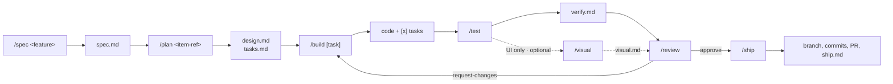
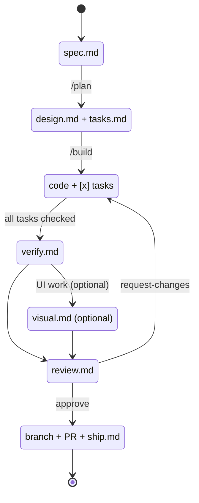

# opencode-framework

A portable, prompt-driven development workflow for [opencode](https://opencode.ai).
It gives a coding project a disciplined lifecycle — from requirements to a
reviewable pull request — implemented entirely as opencode **agents**,
**commands**, and **skills**. There is no runtime code to install.

Copy it into any repository, run `/bootstrap`, and every task has a clear track:
spec it, design it, build it, test it, review it, ship it.

## Why

Most agent setups fail in one of two ways: the agent has no memory of *why* a
change exists, or it happily declares success without evidence. This framework
addresses both:

- **Artifacts before code.** Each phase produces a committed file under
  `work/<item-ref>/` that the next phase reads. Intent survives across sessions,
  teammates, and CI.
- **Evidence over assertion.** Builders run the project's checks; testers map
  every acceptance criterion to a test; reviewers cite `file:line`; shippers
  verify before committing.
- **Hard guardrails.** Only the shipper commits, and only when you explicitly ask
  — `/ship` for a work item, or `/ship fix` for a verified fix. Reviewers and
  product agents cannot create, modify, or delete source through the file tools;
  their bash access is an inspection allowlist, not a sandbox (see the
  [permission caveat](docs/customization.md#permissions)). Secrets are a stop
  condition.
- **Right-sized process.** `/fix` for small defects, the full lifecycle for real
  features.

## Requirements

- opencode `1.18+`.
- A git repository (for `/ship`), with `gh` authenticated if you want PR
  creation.

## Quickstart

### 1. Adopt into a project

From your project root, copy the framework files in:

```bash
FRAMEWORK=/path/to/opencode-framework
mkdir -p .opencode
cp -r "$FRAMEWORK/.opencode/agent" "$FRAMEWORK/.opencode/command" "$FRAMEWORK/.opencode/skill" .opencode/
rm -f .opencode/agent/doctor.md .opencode/command/doctor.md
cp "$FRAMEWORK/AGENTS.md" "$FRAMEWORK/opencode.json" "$FRAMEWORK/.gitignore" .
mkdir -p docs && cp "$FRAMEWORK"/docs/*.md docs/
mkdir -p work && touch work/.gitkeep
```

Copy only the `agent/`, `command/`, and `skill/` subdirectories — opencode
generates `.opencode/node_modules/` and package files locally when it runs, and
those should not be copied between projects.

The quickstart then removes `.opencode/agent/doctor.md` and
`.opencode/command/doctor.md`. The `doctor` agent and `/doctor` command are
**framework-maintainer only**: the diagnostic reads the framework `README.md`'s
inventory tables and layout counts, which this quickstart never copies, so it
would report a cascade of false drift findings in any other repository. If you
adopted before this change, remove or ignore those two files — they are not
authoritative outside the framework repository. Copying `.opencode/` by some
other means that retains them will make `/doctor` misreport.

The quickstart copy set also deliberately excludes `tests/` and `.github/`. The
committed test suite and its CI workflow are **framework-maintainer-only**: they
assert agreement among this repository's own docs, configuration, and prompts,
which an adopter's repository does not share. See
[`tests/README.md`](tests/README.md) for the canonical command and scope.

The root packaging files are likewise outside the copied set:
[`LICENSE`](LICENSE), [`CONTRIBUTING.md`](CONTRIBUTING.md),
[`CHANGELOG.md`](CHANGELOG.md), and [`VERSION`](VERSION) are
**framework-repo/maintainer-only** — the framework's own license, contribution
guide, changelog, and version manifest. The quickstart never copies them into an
adopted repository, so **already-adopted repositories need no action**:
re-running the quickstart adds nothing, and an existing `LICENSE`,
`CONTRIBUTING.md`, `CHANGELOG.md`, or `VERSION` in your repository is neither
overwritten nor conflicted with.

If the project already has an `AGENTS.md`, `opencode.json`, or `.gitignore`,
merge rather than overwrite — the framework files are authored to merge cleanly.

The framework does not ignore `work/`. Workflow artifacts are committed working
state, so a fresh clone, a teammate, and CI derive the same phase; only
`scratch/` and tooling output (`.playwright-mcp/`) stay ignored. If your project
already ignores `work/`, `/bootstrap` removes that rule. A local-only posture is
an unsupported override: PR artifact links and fresh-clone, teammate, and CI
state will not work.

### 2. Bootstrap

Start opencode in the project and run:

```
/bootstrap
```

The `bootstrap` agent detects your language, package manager, and the real
install / test / lint / typecheck / format / build commands, confirms them with
you, fills in the **Project profile** in `AGENTS.md`, prunes the stack skill you
do not need, and — if it finds a frontend — offers to enable the Playwright MCP
for visual QA.

### 3. Work

```
/spec add dark mode        # requirements → work/0001-add-dark-mode/spec.md
/plan 0001-add-dark-mode    # design + tasks
/build                       # implement the next task
/test                        # verify against acceptance criteria
/review                      # read-only review of the diff
/ship                        # branch, commits, PR, ship.md
```

Not sure where things stand? `/status`. Fixing a small bug? `/fix <description>`,
then land it with `/ship fix`.

## The lifecycle



Phase state is derived from which artifacts exist — there is no state file to
drift:



Each phase reads the previous artifact and writes its own. Full details in
[`docs/workflow.md`](docs/workflow.md).

For a broad, multi-feature initiative, plan first with `/roadmap <initiative>`,
which creates a parent roadmap item (`work/<NNNN-slug>/roadmap.md`) enumerating
child features and their dependencies, each nested at
`work/<NNNN-slug>/<MMMM-slug>/`. Every child is then addressed by its
**canonical reference** (`NNNN-slug/MMMM-slug`) and runs the ordinary lifecycle
unchanged. A standalone item is still just `NNNN-slug`.

## Commands

| Command            | Agent       | What it does                                             |
| ------------------ | ----------- | -------------------------------------------------------- |
| `/spec <feature>`  | `product`   | Requirements → `spec.md`                                 |
| `/plan <item-ref>` | `architect` | Design + task breakdown → `design.md`, `tasks.md`        |
| `/build [task]`    | `builder`   | Implement a task; update `tasks.md`                      |
| `/test [item-ref]` | `tester`    | Verify acceptance criteria → `verify.md`                 |
| `/visual [url]`    | `visual`    | Browser QA of a running UI → `visual.md` (optional)      |
| `/review [item-ref]`| `reviewer` | Read-only review → `review.md`                           |
| `/ship [item-ref]` | `shipper`   | Branch, conventional commits, PR, `ship.md`              |
| `/fix <bug>`       | `builder`   | Lightweight reproduce → fix → test; land with `/ship fix` |
| `/roadmap <initiative>` | `roadmap` | Decompose a multi-feature initiative → `roadmap.md` + child dirs |
| `/status`          | `status`    | Report each work item's phase (read-only)                |
| `/doctor`          | `doctor`    | Read-only framework drift check: inventories, counts, permissions, ignore rules — framework-maintainer only |
| `/bootstrap`       | `bootstrap` | Adopt the framework into the current repository          |

## Agents

| Agent       | Mode      | Can edit                                | Can run bash          |
| ----------- | ----------------- | --------------------------------------- | --------------------------- |
| `product`   | primary (default) | `work/**` + `**/work/**`                | read-only, best-effort †    |
| `architect` | primary           | `work/**` + `**/work/**`                | read-only, best-effort †    |
| `roadmap`   | primary           | `work/**` + `**/work/**`                | read-only, best-effort †    |
| `builder`   | primary           | any source                              | allow                       |
| `tester`    | primary           | test files + `work/**` + `**/work/**`   | allow                       |
| `visual`    | all               | `work/**` + `**/work/**`                | allow                       |
| `reviewer`  | all               | `work/**` + `**/work/**`                | read-only, best-effort †    |
| `shipper`   | primary           | `work/**` + `**/work/**`                | git/gh allowlist            |
| `bootstrap` | primary           | config files + `work/**` + `**/work/**` | allow                       |
| `status`    | primary           | none                                    | read-only, best-effort †    |
| `scout`     | subagent          | none                                    | allow                       |
| `scribe`    | subagent          | `work/**` + `**/work/**`                | none                        |
| `ask`       | primary           | none                                    | none                        |
| `doctor`    | primary           | none                                    | read-only, best-effort †    |

> † The "Can run bash" column is a best-effort allowlist, not a sandbox.
> opencode matches bash rules by command prefix and cannot prevent shell
> redirection or output-to-file flags. See
> [`docs/customization.md`](docs/customization.md) for the full permission
> model.

File-tool permissions are enforced by opencode, not just requested in prose. In
opencode, the `edit` permission covers **create, write, and patch** — there is no
separate `write` grant — and tool paths reach the check in both relative

(`work/<item-ref>/spec.md`) and absolute (`/repo/work/<item-ref>/spec.md`) forms.
Artifact-writing agents therefore declare **both** `work/**` and `**/work/**`;
declaring only one leaves the other form to fall through to the catch-all deny.

Bash permissions are **best-effort**, not a sandbox. opencode matches bash rules
by command prefix, so an allowlist cannot prevent shell redirection
(`ls > file`) or output-to-file flags (`tree -o file`, `git diff --output=file`).
Agents with broad bash — `bootstrap`, `scout`, `tester`, and `visual` — can
therefore modify files through the shell even when their `edit` permission is
restricted. See [`docs/customization.md`](docs/customization.md) for the full
permission model.

## Skills

| Skill                  | Used for                                              |
| ---------------------- | ----------------------------------------------------- |
| `project-discovery`    | Finding the project's real commands and stack         |
| `typescript-node`      | TS/JS conventions and tooling                         |
| `python`               | Python conventions and tooling                        |
| `spec-writing`         | Goals, non-goals, user stories, acceptance criteria   |
| `test-strategy`        | Test levels, behavior vs implementation, mocking      |
| `browser-verification` | Inspecting a frontend in a real browser               |
| `code-review`          | Review checklist, severity, finding format            |
| `conventional-commits` | Commit messages and branch naming                     |
| `pr-workflow`          | PR titles, descriptions, `gh` usage                   |
| `workflow-lifecycle`   | Routing between phases and reporting handoffs         |

## Layout

```
.opencode/
  agent/     # 14 role prompts
  command/   # 12 slash commands
  skill/     # 10 knowledge skills
docs/
  workflow.md               # lifecycle, phases, state, routing
  artifact-conventions.md   # exact format of every artifact
  customization.md          # extend agents/skills/commands
AGENTS.md                   # always-loaded workflow contract + project profile
opencode.json               # model, default agent, permissions, instructions, MCP
README.md                   # this file
LICENSE                     # MIT license (maintainer-only)
CONTRIBUTING.md             # contribution and release guide (maintainer-only)
CHANGELOG.md                # release history (maintainer-only)
VERSION                     # version source of truth (maintainer-only)
tests/                      # committed test suite (maintainer-only)
work/                       # per-feature artifacts (committed)
scratch/                    # temporary files and background logs (git-ignored)
```

## Configuration

`opencode.json` sets the model (default `deepseek/deepseek-flash`), the default
agent (`product`), the always-loaded instruction files, baseline permissions
(force-push, `reset --hard`, `rm -rf`, and `sudo` require confirmation), and
optional MCP servers. Agents override permissions in their frontmatter; see
[`docs/customization.md`](docs/customization.md).

Always-loaded instruction files: `AGENTS.md`, `docs/workflow.md`, `docs/artifact-conventions.md`.
Their purpose and per-request token cost are documented in
[`docs/customization.md`](docs/customization.md#always-loaded-instructions).
The default `deepseek/deepseek-flash` is vision-capable and the strongest model
the framework ships; every agent inherits it, so `/visual` and `/reviewer` need
no per-agent model overrides.

The Playwright MCP server is **disabled by default** because an enabled server
adds its tool schemas to every request. `/bootstrap` enables it when it detects a
frontend, which turns on `/visual` and the `browser-verification` skill.

Config is read once at startup. **Restart opencode after changing any agent,
command, skill, or config file.**

## Philosophy

- The user owns decisions; agents recommend and ask.
- The smallest change that satisfies the acceptance criteria wins.
- Discovery before action; evidence before claims.
- No artifact is rewritten by a phase that does not own it.

## License

Released under the [MIT License](LICENSE).
