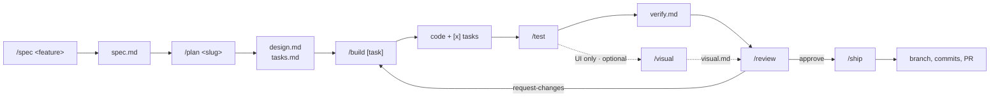
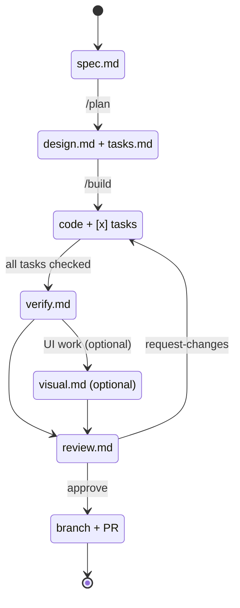

# opencode-framework

A portable, prompt-driven development workflow for [opencode](https://opencode.ai).
It gives a coding project a disciplined lifecycle — from requirements to a
reviewable pull request — implemented entirely as opencode **agents**,
**commands**, and **skills**. There is no runtime code to install.

Copy it into any repository, run `/bootstrap`, and every task has a clear track:
spec it, design it, build it, test it, review it, ship it.

## Why

Most agent setups fail in one of two ways: the agent has no memory of *why* a
change exists, or it happily declares success without evidence. This framework
addresses both:

- **Artifacts before code.** Each phase produces a file under `work/<NNNN-slug>/`
  that the next phase reads. Intent survives across sessions.
- **Evidence over assertion.** Builders run the project's checks; testers map
  every acceptance criterion to a test; reviewers cite `file:line`; shippers
  verify before committing.
- **Hard guardrails.** Only the shipper commits, and only when you run `/ship`.
  Reviewers and product agents cannot touch source. Secrets are a stop condition.
- **Right-sized process.** `/fix` for small defects, the full lifecycle for real
  features.

## Requirements

- opencode `1.18+`.
- A git repository (for `/ship`), with `gh` authenticated if you want PR
  creation.

## Quickstart

### 1. Adopt into a project

From your project root, copy the framework files in:

```bash
FRAMEWORK=/path/to/opencode-framework
mkdir -p .opencode
cp -r "$FRAMEWORK/.opencode/agent" "$FRAMEWORK/.opencode/command" "$FRAMEWORK/.opencode/skill" .opencode/
cp "$FRAMEWORK/AGENTS.md" "$FRAMEWORK/opencode.json" "$FRAMEWORK/.gitignore" .
mkdir -p docs && cp "$FRAMEWORK"/docs/*.md docs/
mkdir -p work && touch work/.gitkeep
```

Copy only the `agent/`, `command/`, and `skill/` subdirectories — opencode
generates `.opencode/node_modules/` and package files locally when it runs, and
those should not be copied between projects.

If the project already has an `AGENTS.md`, `opencode.json`, or `.gitignore`,
merge rather than overwrite — the framework files are authored to merge cleanly.

### 2. Bootstrap

Start opencode in the project and run:

```
/bootstrap
```

The `bootstrap` agent detects your language, package manager, and the real
install / test / lint / typecheck / format / build commands, confirms them with
you, fills in the **Project profile** in `AGENTS.md`, prunes the stack skill you
do not need, and — if it finds a frontend — offers to enable the Playwright MCP
for visual QA.

### 3. Work

```
/spec add dark mode        # requirements → work/0001-add-dark-mode/spec.md
/plan 0001-add-dark-mode    # design + tasks
/build                       # implement the next task
/test                        # verify against acceptance criteria
/review                      # read-only review of the diff
/ship                        # branch, commits, PR
```

Not sure where things stand? `/status`. Fixing a small bug? `/fix <description>`.

## The lifecycle



Phase state is derived from which artifacts exist — there is no state file to
drift:



Each phase reads the previous artifact and writes its own. Full details in
[`docs/workflow.md`](docs/workflow.md).

## Commands

| Command            | Agent       | What it does                                             |
| ------------------ | ----------- | -------------------------------------------------------- |
| `/spec <feature>`  | `product`   | Requirements → `spec.md`                                 |
| `/plan <slug>`     | `architect` | Design + task breakdown → `design.md`, `tasks.md`        |
| `/build [task]`    | `builder`   | Implement a task; update `tasks.md`                      |
| `/test [slug]`     | `tester`    | Verify acceptance criteria → `verify.md`                 |
| `/visual [url]`    | `visual`    | Browser QA of a running UI → `visual.md` (optional)      |
| `/review [slug]`   | `reviewer`  | Read-only review → `review.md`                           |
| `/ship [slug]`     | `shipper`   | Branch, conventional commits, PR                         |
| `/fix <bug>`       | `builder`   | Lightweight reproduce → fix → test path                  |
| `/status`          | `status`    | Report each work item's phase (read-only)                |
| `/bootstrap`       | `bootstrap` | Adopt the framework into the current repository          |

## Agents

| Agent       | Mode      | Can edit                  | Can run bash          |
| ----------- | --------- | ------------------------- | --------------------- |
| `product`   | primary   | `work/**` only            | read-only allowlist   |
| `architect` | primary   | `work/**` only            | read-only allowlist   |
| `builder`   | primary   | any source                | allow                 |
| `tester`    | primary   | test files + `work/**`    | allow                 |
| `visual`    | all       | `work/**` only            | allow                 |
| `reviewer`  | all       | `work/**` only            | read-only allowlist   |
| `shipper`   | primary   | none                      | git/gh allowlist      |
| `bootstrap` | primary   | config files + `work/**`  | allow                 |
| `status`    | primary   | none                      | read-only allowlist   |
| `scout`     | subagent  | none                      | allow                 |
| `scribe`    | subagent  | `work/**` only            | none                  |

Permissions are enforced by opencode, not just requested in prose.

## Skills

| Skill                  | Used for                                              |
| ---------------------- | ----------------------------------------------------- |
| `project-discovery`    | Finding the project's real commands and stack         |
| `typescript-node`      | TS/JS conventions and tooling                         |
| `python`               | Python conventions and tooling                        |
| `spec-writing`         | Goals, non-goals, user stories, acceptance criteria   |
| `test-strategy`        | Test levels, behavior vs implementation, mocking      |
| `browser-verification` | Inspecting a frontend in a real browser               |
| `code-review`          | Review checklist, severity, finding format            |
| `conventional-commits` | Commit messages and branch naming                     |
| `pr-workflow`          | PR titles, descriptions, `gh` usage                   |
| `workflow-lifecycle`   | Routing between phases and reporting handoffs         |

## Layout

```
.opencode/
  agent/     # 11 role prompts
  command/   # 10 slash commands
  skill/     # 10 knowledge skills
docs/
  workflow.md               # lifecycle, phases, state, routing
  artifact-conventions.md   # exact format of every artifact
  customization.md          # extend agents/skills/commands
AGENTS.md                   # always-loaded workflow contract + project profile
opencode.json               # model, default agent, permissions, instructions, MCP
work/                       # per-feature artifacts (git-ignored)
```

## Configuration

`opencode.json` sets the model (default `deepseek/deepseek-flash`), the default
agent (`builder`), the always-loaded instruction files, baseline permissions
(force-push, `reset --hard`, `rm -rf`, and `sudo` require confirmation), and
optional MCP servers. Agents override permissions in their frontmatter; see
[`docs/customization.md`](docs/customization.md).

The Playwright MCP server is **disabled by default** because an enabled server
adds its tool schemas to every request. `/bootstrap` enables it when it detects a
frontend, which turns on `/visual` and the `browser-verification` skill.

Config is read once at startup. **Restart opencode after changing any agent,
command, skill, or config file.**

## Philosophy

- The user owns decisions; agents recommend and ask.
- The smallest change that satisfies the acceptance criteria wins.
- Discovery before action; evidence before claims.
- No artifact is rewritten by a phase that does not own it.
